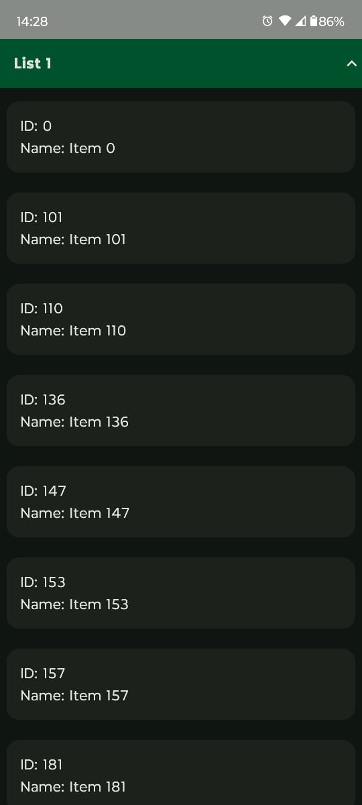
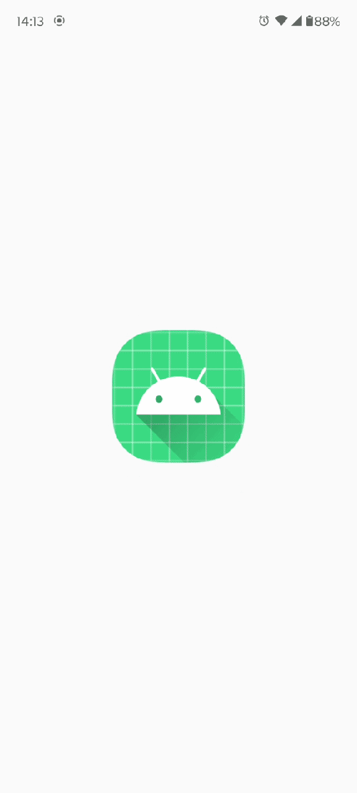

# Fetch Rewards Coding Exercise - Software Engineering - Mobile
Native Android app in Kotlin that retrieves the data from https://fetch-hiring.s3.amazonaws.com/hiring.json.
## Requirements
Display this list of items to the user based on the following requirements:

* Display all the items grouped by "listId"
* Sort the results first by "listId" then by "name" when displaying.
* Filter out any items where "name" is blank or null.

## Project Overview
* Language: Kotlin
* Framework: Android SDK & Jetpack Compose
* Build System: Gradle
* Version Control: Git
* Dependency Injection: Koin
* Architecture: MVI (Model-View-Intent)

## App Screenshots

  
  

## App Working - Expandable list with sticky header

  

# Author
[Abishek Thirumoorthi](https://github.com/abishek-thiru)
